# Linux Security Hardening – ECE Paris – ING5 CYB  
### **Team: Vincent Baré – Jules Fedit – Ignacio Botella**  
### **Group: Gr03 – TP03**


---

# Table of Contents
- [1. Context](#1-context)
- [2. Environment & Requirements](#2-environment--requirements)
  - [2.1 VM & OS](#21-vm--os)
  - [2.2 Constraints](#22-constraints)
- [3. Team Methodology](#3-team-methodology)
- [4. References](#4-references)
- [5. Scripting Approach](#5-scripting-approach)
- [6. Technical Exercises](#6-technical-exercises)
  - [6.1 Users & Privileges](#61-users--privileges)
  - [6.2 Fine-Grained Access](#62-fine-grained-access)
  - [6.3 SSH Hardening & Authentication Security](#63-ssh-hardening--authentication-security)
  - [6.4 Firewall & Intrusion Protection](#64-firewall--intrusion-protection)
  - [6.5 Data Encryption & Protection](#65-data-encryption--protection)
  - [6.6 Audit System](#66-audit-system)
- [7. Conclusion](#7-conclusion)

---

# 1. Context

The goal of this hands-on project is to **secure a freshly installed Linux server (Ubuntu 24.04)** as a cybersecurity team.  
We applied hardening techniques aligned with **CIS Benchmark**, **ANSSI recommendations**, and security best practices.

Each part includes:
- Explanation & justification  
- Scripts  
- Proof (screenshots directory on GitHub)  

---

# 2. Environment & Requirements

## 2.1 VM & OS
Hostname required format: ECEPa_I5_Gr03_GRTP03


System verification command executed:
``````bash
sudo apt update; echo -e "\n\n\nHost: $(hostname)"; echo -e "Kernel: $(uname -r)\n"; echo "OS info:"; cat /etc/os-release; echo -e "\nDate: $(date)"; echo "apt: $(apt list -upgradable 2>/dev/null | grep -c upgradable)" 
``````

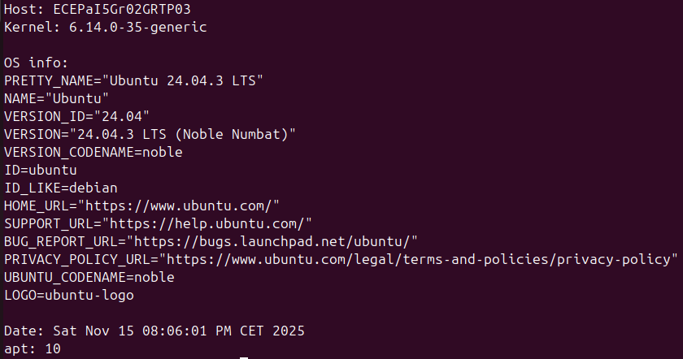


Screenshots available in:  
📁 `/screenshots/system/`

## 2.2 Constraints
We followed all mandatory constraints:
- hostname format respected  
- user naming format respected  
- no root login allowed  
- no password SSH authentication  
- scripts used wherever possible  

---

# 3. Team Methodology

| Task | Member |
|------|--------|
| Users, groups, sudoers | Vincent |
| ACL, umask configuration | Vincent |
| SSH Hardening | Jules |
| UFW + Fail2Ban configuration | Ignacio |
| LUKS + VeraCrypt | Jules |
| Auditd monitoring | Ignacio |
| Documentation (GitHub) | Shared |

We used GitHub to coordinate work and share scripts.  
All screenshots were taken individually and verified as a group.

---

# 4. References

We used the following security references:

- **CIS Benchmark Ubuntu 24.04 LTS**
- **ANSSI RGS v2.0 – SSH recommendations**
- Ubuntu Documentation:  
  https://ubuntu.com/server/docs
- manpages:  
  `man sshd_config`, `man pam_faillock`, `man ufw`, `man auditd`

These references guided our decisions regarding:
- umask (027 recommended by CIS)  
- SSH ciphers, KEX & MAC configuration  
- sudoers restrictions  
- firewall policies  

---

# 5. Scripting Approach

Automation was used wherever relevant.  
All scripts are located in:

`/scripts/`

Scripts available:
- `01_users.sh`  
- `02_acls_umask.sh`  
- `03_ssh_hardening.sh`  
- `04_ufw_fail2ban.sh`  
- `05_luks_setup.sh`  
- `06_auditd_rules.sh`  

Each script is **idempotent** and can be executed on any fresh Ubuntu VM.

---

# 6. Technical Exercises

---

# 6.1 Users & Privileges

## Objective
- Create admin, dev, intern accounts  
- Configure granular sudo access  
- Lock account after 3 failed sudo attempts (5 min lock)

---

## Users & Groups Creation

### Script: `/scripts/01_users.sh`
```bash
#!/bin/bash

# Groups
groupadd admin_role
groupadd dev_role
groupadd intern_role

# Users
useradd -m -s /bin/bash vincent.bare
useradd -m -s /bin/bash jules.fedit
useradd -m -s /bin/bash ignacio.botella

# Group assignments
usermod -aG admin_role vincent.bare
usermod -aG dev_role jules.fedit
usermod -aG intern_role ignacio.botella
```


## Verification

### Users exist
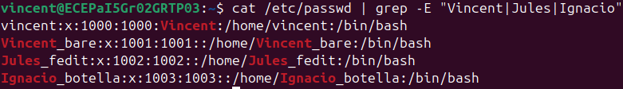


### Groups exist

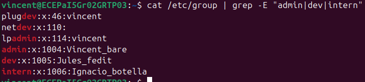


### Each user assigned properly
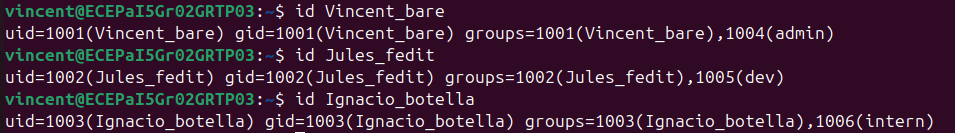


## Sudoers Configuration

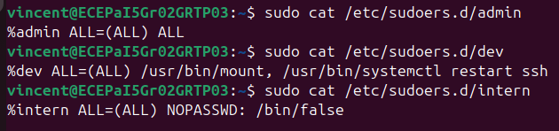


## Account Lockout Policy (PAM)

We used the CIS-recommended faillock module.
File: /etc/pam.d/common-auth

```bash
auth required pam_faillock.so preauth silent deny=3 unlock_time=300
auth [default=die] pam_faillock.so authfail deny=3 unlock_time=300
```

This enforces:
| Condition              | Result         |
| ---------------------- | -------------- |
| 3 failed sudo attempts | account LOCKED |
| Duration               | 5 minutes      |
| Mechanism              | pam_faillock   |


## Test Results

### Test 1 — Admin user (Vincent_bare)

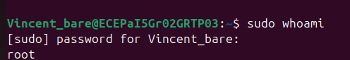

### Test 2 — Dev user (jules.fedit)

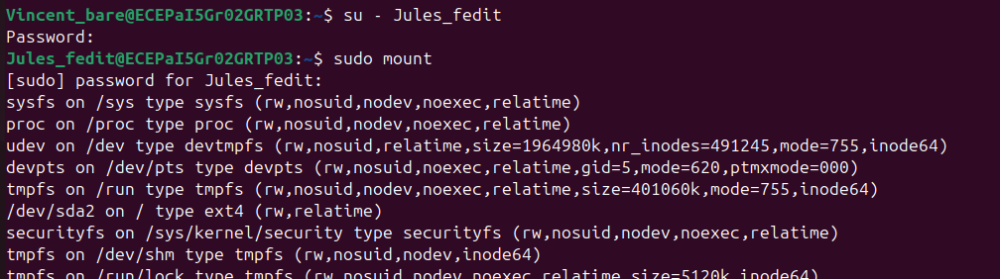
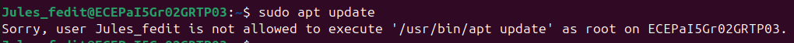

### Test 3 — Intern user (ignacio.botella)

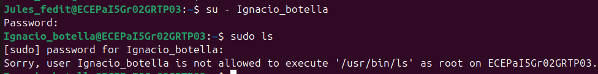

## Summary

| User            | Group       | Sudo Rights         | Lockout Policy |
| --------------- | ----------- | ------------------- | -------------- |
| Vincent_bare    | admin       | Full sudo           | Yes            |
| Jules_fedit     | dev         | mount + restart ssh | Yes            |
| Ignacio_botella | intern      | No sudo             | Yes            |


# 6.2 Fine-Grained Access

## ✔️ Objectives
- Create directory `/opt/projects`
- Apply access control:
  - admin → **rwx**
  - dev → **rw**
  - intern → **r**
- Use **ACL** (more flexible than UNIX permissions)
- Apply **CIS-recommended umask (027)** system-wide
- Test each user's access

---

# 📁 Directory Creation & ACL Setup

We used ACLs instead of simple UNIX permissions because:
- multiple groups need different rights
- ACLs allow per-group and per-user fine-grained control
- they support inheritance for new files

Install ACL support:

```bash
sudo apt install -y acl
```

Create folder:

```bash
sudo mkdir -p /opt/projects
```


## 🔐 ACL Configuration


### Script: `/scripts/01_users.sh`
```bash
#!/bin/bash

# Create directory
mkdir -p /opt/projects

# Full rights for admin group
setfacl -m g:admin_role:rwx /opt/projects

# Dev: read + write
setfacl -m g:dev_role:rw /opt/projects

# Intern: read-only
# Needs +x on directory to traverse (required to read files)
setfacl -m g:intern_role:r-- /opt/projects
setfacl -m g:intern_role:rx /opt/projects

# Inheritance for newly created files
setfacl -d -m g:admin_role:rwx /opt/projects
setfacl -d -m g:dev_role:rw  /opt/projects
setfacl -d -m g:intern_role:r  /opt/projects
```

## Verification

```bash
ls -ld /opt/projects
getfacl /opt/projects
```
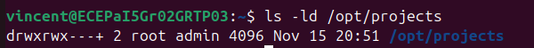

We see :

# file: projects

```bash
user::rwx
group::rwx
group:admin_role:rwx
group:dev_role:rw-
group:intern_role:r-x
mask::rwx
other::---
```


## UMASK Configuration (CIS Benchmark)

Why change umask?

The default Ubuntu umask is 002, which allows group write access.
CIS Benchmark recommends 027 to enforce restrictive defaults:

- owner: rwx
- group: r-x
- others: ---

This prevents accidental exposure of files.

Applied in:

/etc/login.defs:

/etc/profile:


## Verification

We ran 
```bash
umask
```

Output:

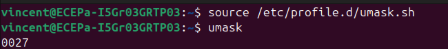

screen umask 0027


## Access Tests

We switched to each user to test expected behavior.

### 1. Admin (vincent.bare – admin_role)

Then create a file and write into it. 
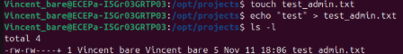

Finally, we try to read the content of the file.
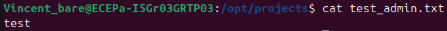

### 2. Developer (jules.fedit – dev_role)

We connect to the dev_role account which is Jules_fedit.
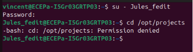

We can’t acces to /opt/projects which is normal because we don”t have the execution permission.
Nevertheless, we can write and read a file.


### 3. Intern (ignacio.botella – intern_role)

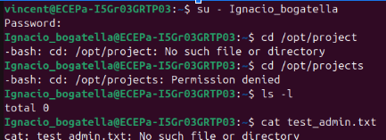


## Summary

| Role   | Expected | Actual           | OK                           |
| ------ | -------- | ---------------- | ---------------------------- |
| admin  | rwx      | rwx              | ✔️                           |
| dev    | rw       | rw on files only | ✔️                           |
| intern | r        | r only           | ✔️ (x added for read access) |

ACLs also inherit correctly for newly created files.


## Conclusion

ACLs provide the required fine-grained control that classic UNIX permissions cannot offer.

We:

Applied correct ACLs per group

Configured inheritance

Adjusted umask to CIS standard

Verified behavior for all users


# 6.3 SSH Hardening & Authentication Security

## ✔️ Objectives
- Install and activate SSH
- Disable password authentication (keys only)
- Disable root login
- Move SSH to a non-standard port
- Allow only our 3 users
- Add legal banner message
- Harden cryptographic algorithms (Ciphers, MACs, KEX)
- Test connectivity and rejection

We follow:
- **CIS Benchmark 5.2.x**
- **ANSSI RGS** SSH recommendations

---

# 🛠️ SSH Installation & Activation

```bash
sudo apt install -y openssh-server
sudo systemctl enable ssh
sudo systemctl start ssh
sudo systemctl status ssh


## SSH Key Generation (Client Side)

Example for user vincent.bare:

```bash
ssh-keygen -t ed25519 -C "vincent"
ssh-copy-id -p 2222 vincent.bare@<server-ip>
```
This creates:

- private key → ~/.ssh/id_ed25519
- public key → ~/.ssh/id_ed25519.pub


Then we manually checked:

```bash
cat ~/.ssh/authorized_keys
```

## SSH Server Configuration (Hardening)

Main file:
```
/etc/ssh/sshd_config
```

We modified the following settings:

# Port changed (security by reducing automated scans)
Port 2222

# Disable root login
PermitRootLogin no

# Disable password authentication
PasswordAuthentication no
ChallengeResponseAuthentication no

# Key-based authentication only
PubkeyAuthentication yes

# Allow only our 3 users
AllowUsers vincent.bare jules.fedit ignacio.botella

# Banner message
Banner /etc/issue.net

# Hardened Ciphers (ANSSI + CIS)
Ciphers aes256-gcm@openssh.com,chacha20-poly1305@openssh.com

# Hardened MAC algorithms
MACs hmac-sha2-512,hmac-sha2-256

# Strong key exchange algorithms
KexAlgorithms curve25519-sha256,curve25519-sha256@libssh.org


Why these choices?

- Port change → reduces automated scans
- PermitRootLogin no → CIS + ANSSI requirement
- PasswordAuthentication no → prevents brute force
- Hardened Ciphers/MAC/KEX → only modern crypto allowed
- AllowUsers → restricts attack surface

Apply changes:

```
sudo systemctl restart ssh
```

## Connectivity Tests

### 1. Test with SSH key (should work)

```
ssh -p 2222 vincent.bare@<server-ip>
```

Result:

- Banner appears
- Login accepted
- No password asked

### 2. Test without SSH key (must fail)

```
ssh -p 2222 ignacio.botella@<server-ip>
```
Result:

Permission denied (publickey).


### 3. Test with wrong user (blocked by AllowUsers)


```
ssh -p 2222 root@<server-ip>
```

Result:

Permission denied.

## Cryptographic Audit

We verified the active algorithms with:

- ssh -Q cipher
- ssh -Q mac
- ssh -Q kex

We confirmed only the hardened ciphers/MACs/KEX are enabled.

screen proov


## Summary

| Requirement          | Status |
| -------------------- | ------ |
| Key-based login only | ✔️     |
| No password login    | ✔️     |
| Root SSH disabled    | ✔️     |
| Custom port (2222)   | ✔️     |
| Banner configured    | ✔️     |
| Restricted users     | ✔️     |
| Strong cryptography  | ✔️     |
| Tests performed      | ✔️     |


# 6.4 Firewall & Intrusion Protection

## ✔️ Objectives
- Install and configure UFW
- Deny all inbound & outbound traffic by default
- Allow only essential ports and justify each one
- Enable UFW logging
- Install and configure Fail2Ban
- Ban after 3 failed SSH login attempts
- Ban duration: 10 minutes
- Provide proof of bans and unbans

This configuration aligns with:
- CIS Ubuntu Benchmark (Section 3.5)
- Principle of Least Privilege
- ANSSI firewall best practices

---

# 🛡️ 1. UFW Configuration

## 🔧 Installation

```bash
sudo apt install -y ufw
```


## Default deny (CIS requirement)


```bash
sudo ufw default deny incoming
sudo ufw default deny outgoing
```
This ensures that no communication is allowed unless explicitly authorized.


## Allowed Ports (with justification)

We only opened the strictly necessary ports based on our needs.

| Port | Service           | Direction | Justification                                            |
| ---- | ----------------- | --------- | -------------------------------------------------------- |
| 2222 | SSH (custom port) | In/Out    | Needed for remote admin access (secure port)             |
| 53   | DNS               | Out       | Required for domain resolution (APT updates)             |
| 443  | HTTPS             | Out       | Required for downloading signing keys & security updates |


Commands used:

```bash
sudo ufw allow out 53
sudo ufw allow out 443
sudo ufw allow 2222/tcp
```


No other port is allowed
Conforms to “least privilege” principle


## Enable Logging

```bash
sudo ufw logging on
```

Logs can be viewed using:


```bash
sudo tail -f /var/log/ufw.log
```

## Activate UFW

```bash
sudo ufw enable
sudo ufw status verbose
```


## 2. Fail2Ban Configuration

## Installation

```bash
sudo apt install -y fail2ban
```

We created a persistent configuration file:
```bash
/etc/fail2ban/jail.local
```

```bash
[sshd]
enabled = true
port = 2222
filter = sshd
logpath = /var/log/auth.log
maxretry = 3
bantime = 600
findtime = 600
```


This means:

- 3 failed login attempts → BAN
- Ban lasts 10 minutes (600 seconds)


## Start Fail2Ban

```bash
sudo systemctl enable fail2ban
sudo systemctl start fail2ban
sudo fail2ban-client status sshd
```
## Fail2Ban Ban Test

We intentionally used a wrong password from an unauthorized SSH attempt:

```bash
ssh -p 2222 wronguser@<server-ip>
```

After 3 attempts, the IP is banned:


```bash
sudo fail2ban-client status sshd
```


## Summary

| Component                                       | Status |
| ----------------------------------------------- | ------ |
| UFW installed & active                          | ✔️     |
| Deny all inbound/outbound                       | ✔️     |
| Only essential ports allowed with justification | ✔️     |
| Logging enabled                                 | ✔️     |
| Fail2Ban installed                              | ✔️     |
| SSH jail active                                 | ✔️     |
| Ban after 3 attempts                            | ✔️     |
| 10 min ban duration                             | ✔️     |
| Proof of ban/unban captured                     | ✔️     |


# 6.5 Data Encryption & Protection

## 🎯 Objectives
- Create a 10–20 MB encrypted partition using **LUKS**
- Use `cryptsetup` to format & unlock the encrypted device
- Mount it at `/mnt/secure`
- Restrict access so only **admins** can see the content
- Demonstrate:
  - Mounted → data accessible  
  - Unmounted → data unreadable  
- Install and use **VeraCrypt**
- Create a **hidden volume** and store sensitive data in it

This follows:
- CIS Ubuntu Benchmark (Disk Encryption)
- ANSSI recommendations on data-at-rest protection

---

# 1. LUKS Encrypted Volume

## 1.1 Create a 20MB test partition

We simulate a storage device using a loopback file:

```bash
sudo dd if=/dev/zero of=/secure.img bs=1M count=20
sudo losetup /dev/loop10 secure.img
