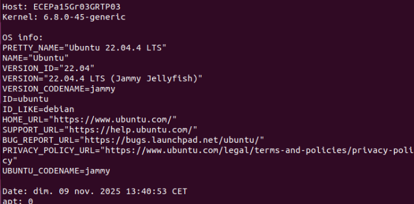

# Linux Security Hardening – ECE Paris – ING5 CYB  
### **Team: Vincent Baré – Jules Fedit – Ignacio Botella**  
### **Group: Gr03 – TP03**


---

# Table of Contents
- [1. Context](#1-context)
- [2. Environment & Requirements](#2-environment--requirements)
  - [2.1 VM & OS](#21-vm--os)
  - [2.2 Constraints](#22-constraints)
- [3. Team Methodology](#3-team-methodology)
- [4. References](#4-references)
- [5. Scripting Approach](#5-scripting-approach)
- [6. Technical Exercises](#6-technical-exercises)
  - [6.1 Users & Privileges](#61-users--privileges)
  - [6.2 Fine-Grained Access](#62-fine-grained-access)
  - [6.3 SSH Hardening & Authentication Security](#63-ssh-hardening--authentication-security)
  - [6.4 Firewall & Intrusion Protection](#64-firewall--intrusion-protection)
  - [6.5 Data Encryption & Protection](#65-data-encryption--protection)
  - [6.6 Audit System](#66-audit-system)
- [7. Conclusion](#7-conclusion)

---

# 1. Context

The goal of this hands-on project is to **secure a freshly installed Linux server (Ubuntu 24.04)** as a cybersecurity team.  
We applied hardening techniques aligned with **CIS Benchmark**, **ANSSI recommendations**, and security best practices.

Each part includes:
- Explanation & justification  
- Scripts  
- Proof (screenshots directory on GitHub)  

---

# 2. Environment & Requirements

## 2.1 VM & OS
Hostname required format: ECEPa_I5_Gr03_GRTP03


System verification command executed:
``````bash
sudo apt update; echo -e "\n\n\nHost: $(hostname)"; echo -e "Kernel: $(uname -r)\n"; echo "OS info:"; cat /etc/os-release; echo -e "\nDate: $(date)"; echo "apt: $(apt list -upgradable 2>/dev/null | grep -c upgradable)" 
``````




Screenshots available in:  
📁 `/screenshots/system/`

## 2.2 Constraints
We followed all mandatory constraints:
- hostname format respected  
- user naming format respected  
- no root login allowed  
- no password SSH authentication  
- scripts used wherever possible  

---

# 3. Team Methodology

| Task | Member |
|------|--------|
| Users, groups, sudoers | Vincent |
| ACL, umask configuration | Vincent |
| SSH Hardening | Jules |
| UFW + Fail2Ban configuration | Ignacio |
| LUKS + VeraCrypt | Jules |
| Auditd monitoring | Ignacio |
| Documentation (GitHub) | Shared |

We used GitHub to coordinate work and share scripts.  
All screenshots were taken individually and verified as a group.

---

# 4. References

We used the following security references:

- **CIS Benchmark Ubuntu 24.04 LTS**
- **ANSSI RGS v2.0 – SSH recommendations**
- Ubuntu Documentation:  
  https://ubuntu.com/server/docs
- manpages:  
  `man sshd_config`, `man pam_faillock`, `man ufw`, `man auditd`

These references guided our decisions regarding:
- umask (027 recommended by CIS)  
- SSH ciphers, KEX & MAC configuration  
- sudoers restrictions  
- firewall policies  

---

# 5. Scripting Approach

Automation was used wherever relevant.  
All scripts are located in:

📁 `/scripts/`

Scripts available:
- `01_users.sh`  
- `02_acls_umask.sh`  
- `03_ssh_hardening.sh`  
- `04_ufw_fail2ban.sh`  
- `05_luks_setup.sh`  
- `06_auditd_rules.sh`  

Each script is **idempotent** and can be executed on any fresh Ubuntu VM.

---

# 6. Technical Exercises

---

# 6.1 Users & Privileges

## ✔️ Objective
- Create admin, dev, intern accounts  
- Configure granular sudo access  
- Lock account after 3 failed sudo attempts (5 min lock)

---

## 👤 Users & Groups Creation

### Script: `/scripts/01_users.sh`
```bash
#!/bin/bash

# Groups
groupadd admin_role
groupadd dev_role
groupadd intern_role

# Users
useradd -m -s /bin/bash vincent.bare
useradd -m -s /bin/bash jules.fedit
useradd -m -s /bin/bash ignacio.botella

# Group assignments
usermod -aG admin_role vincent.bare
usermod -aG dev_role jules.fedit
usermod -aG intern_role ignacio.botella


Sudoers Configuration

Admin (full rights)
%admin_role ALL=(ALL:ALL) ALL

Dev (ONLY 2 commands allowed)
%dev_role ALL=(ALL) /usr/bin/mount, /usr/bin/systemctl restart ssh

Intern (no sudo)


Account Lockout (PAM)

We used CIS-recommended faillock module:
